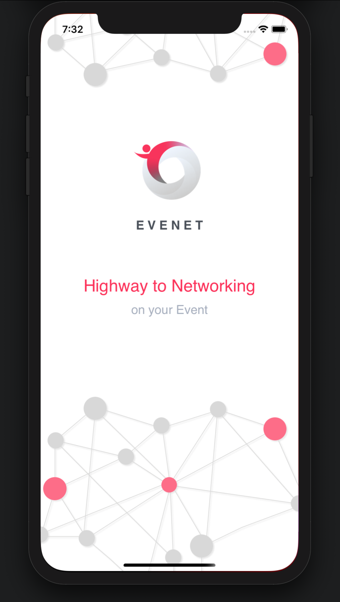
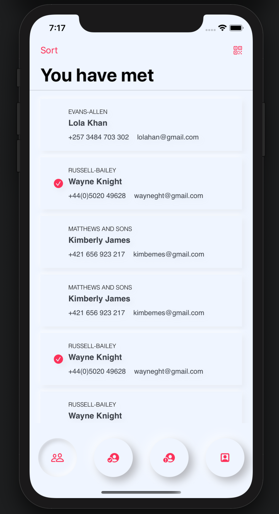
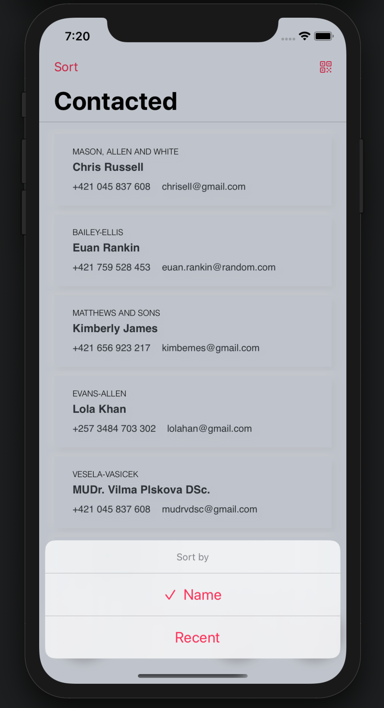
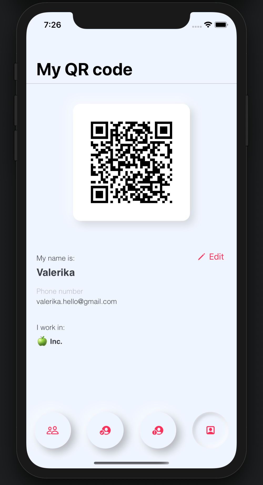

# Evenet
> For fast networking on the event.
>
> App collects contacts of event's participants by scanning QR code, allows to pick uncontacted people out and create notifications.
>
> Written in SwiftUI.

 

### Fuctionality of the App
1. Generates an individual QR code with personal data 
*(name, phone number, email, workplace)*
2. Scans QR codes of other users and saves their data in DocumentsDirectory of the user 
3. Illustrates saved data in the list
4. Allows user to separate contacted people from those who weren't contacted
5. Creates notifications by user's request 

 

### Screenshots

*Launch Screen*

 

*Main Screen*

 
 

*Screen for Contacted Participants*

 

*User's profile with individual QR code*

 

 

### Nice Features 
- Neumorphism in design 🕹
- Sorting by name or date ✌️
- Launch screen 🚀  
- Animated lifting a view with the keyboard 🏗

 
---

### The Author 
I'm UI/UX designer with master degree in Marketing who believes that to code is thrilling. 
Right now I am trying to balance between my design ideas that will make users happy and ability to code them. Sometimes this balance seems more like struggle. But you know, keep moving forward! 

Feel free to [reach out](mailto:Valerika.Hello@gmail.com)  😊

 

### Credits
A heartfelt thank you to [Paul Hudson](https://github.com/twostraws) for the action-packed courses and for the encouragement I needed to get this idea off the ground and start coding 🙌🏼 
I'm grateful for SwiftUI Framework [Code Scanner](https://github.com/twostraws/CodeScanner), which I used in my project. It is available under the MT licence.

